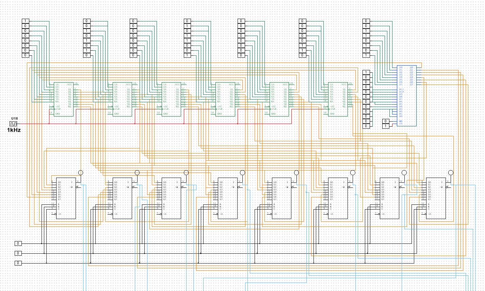
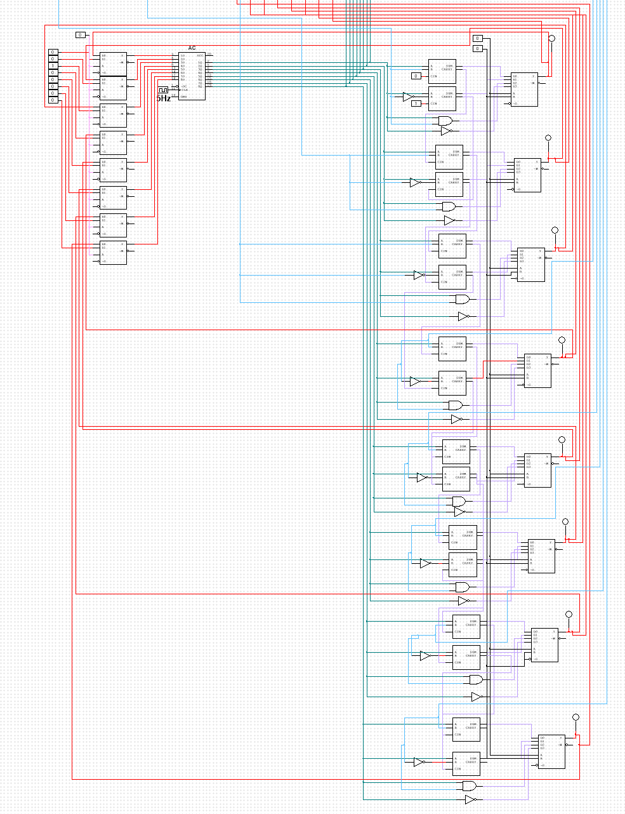

# Bus and Arithmetic Logic Unit (Multisim)

## Overview
Design and simulation of a 6-bit shared system bus integrated with an Accumulator (AC) and a custom Arithmetic Logic Unit (ALU).  
The system demonstrates register-based data transfer, controlled bus selection, and hardware-level arithmetic and logical operations.

---

## System Architecture

### 🔹 Shared Bus
- 6-bit parallel data bus
- Multiplexer-based bus selection
- Controlled data routing between registers and memory
- Synchronous operation with external clock

### 🔹 Registers
- Multiple 6-bit general-purpose registers
- Accumulator (AC)
- Load, Clear, and Increment control signals
- Clock-driven synchronous design

### 🔹 Arithmetic Logic Unit (ALU)
Implemented using combinational logic blocks and full adders:

Supported operations:
- ADD
- SUB (two’s complement based)
- AND
- NOT

The ALU output is written back to the Accumulator.

---

## Control Signals
- Load (LD)
- Clear (CLR)
- Increment (INR)
- Operation Select Lines
- Clock input

---

## Architecture Diagrams

### System Bus

### Arithmetic Logic Unit (ALU)

---

## Files Included
- `Bus + AC.ms14` → Multisim simulation file
- `bus.PNG` → Bus architecture diagram
- `ALU.PNG` → ALU internal structure diagram

---

## Educational Objective
This project demonstrates low-level hardware implementation of:
- Bus-based data movement
- Register-transfer operations
- Hardware arithmetic logic design
- Clocked synchronous digital systems

Designed and simulated using NI Multisim.
